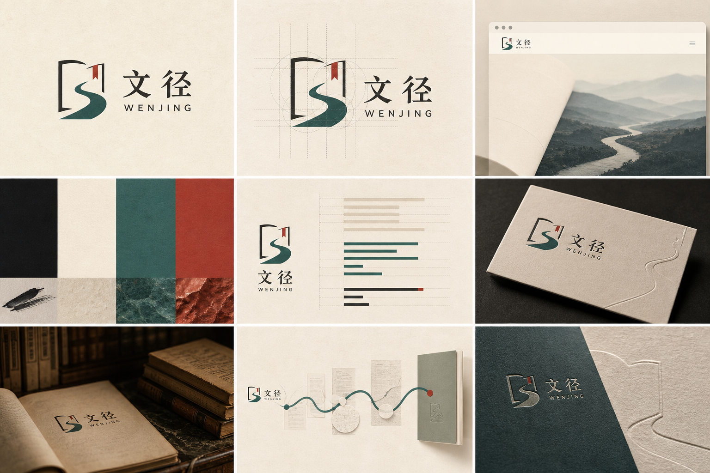

<p align="center">
  
</p>

# 文径 · 文献研究工作台

周日晚上，开题汇报只剩三天。你已经存了几十篇文章，却说不清哪些真的相关、为什么留下。更不敢确定遗漏了什么。

文径从这里开始。先把问题边界写清，再把检索、筛选、证据和取舍一项项留在案头。下一次回看时，你不必靠记忆解释自己当时为什么这样选。

[在线使用（GitHub Pages）](https://joyceleo326.github.io/literature-workbench/) · [备用入口（Vercel）](https://literature-workbench.vercel.app/) · [视觉识别与叙事资产](docs/visual-identity.md)

它适合课程研究、论文准备、开题方案和工作中的案头研究。它不会替你判断证据，也不会把生成内容说成真实文献。重要的结论，仍要回到原文。

## 先把下一步做清楚

1. **建立研究项目**：填写研究问题、年份范围、研究阶段、交付目标、目标数量、纳入条件、排除条件、中英文概念组与可投入时间。
2. **比较三条研究策略**：文径会把研究阶段、题录进度、语言缺口和期限放在一起，给出三条不同路线。每条都说清收益、代价、适用理由和第一步。
3. **人工确认 V1**：选择路线并勾选接受对应取舍后，才会形成可交付的策略版本。没有人工确认时，下载不会被当作已批准结果。
4. **建立检索记录**：由中英文概念组生成布尔检索式，同时记录数据库、检索日期、结果数量和说明。生成的检索式仍需按目标数据库语法人工校正。
5. **维护题录与筛选**：可手动录入，或导入 CSV、JSON、BibTeX、RIS；逐条补充作者、单位、来源、年份、摘要、DOI、链接和 PDF 文件名，并保存纳入、排除、待定及排除理由。
6. **提取与综合证据**：记录核心发现、人工证据等级和主题标签，再检查来源、新近性、反证与分歧。
7. **把真实反馈带回来**：如果你发现范围太宽、来源不足、结论过强或难以交接，可以写下原因。文径先摆出变化，保留旧版；只有重新确认后，才形成 V2 或后续版本。
8. **导出交付物**：下载 UTF-8 BOM CSV、完整 JSON、BibTeX、Markdown 证据综合、质量报告与策略版本档案；完整 JSON 可再次导入并继续工作。

### 第一次体验建议

打开在线入口后，可以直接使用默认示例理解流程，也可以新建空白项目：

1. 在“研究画像”中先确定研究阶段和交付目标；
2. 在“研究边界”中写清问题、年份与纳入/排除条件；
3. 保存边界后会直接进入三条策略决策台；不只看排在前面的路线，也要读完每条路线主动放弃了什么；
4. 确认一条 V1 后进入题录区，至少录入一条可回到原文核验的记录；
5. 完成一次筛选和一次证据提取，再回到策略区提交真实反馈；
6. 对照 V1 与新提案的字段差异，确认后导出 Markdown 策略档案与完整 JSON 备份。

## 一路上不会丢掉的东西

研究常常不是卡在“没有资料”，而是卡在资料和判断分散在不同地方。文径把下面这些东西留在同一个项目里：

- 多研究项目创建、切换、自动保存、完整备份与恢复；
- 研究阶段、交付形式、期限、投入时间和语种缺口都会影响策略排序；
- 恰好三条差异化策略，以及显式收益、代价、适用依据和人工确认；
- 中英文概念组、布尔检索式、检索平台和检索批次记录；
- CSV、JSON、BibTeX、RIS 题录导入，以及 CSV、JSON、BibTeX 导出；
- 标题、摘要、作者、单位、年份、来源、DOI、原文链接、PDF 文件名等题录字段；
- 独立筛选与综合工作区、语言与状态筛选、批量核验、编辑和删除；
- 可解释证据权重、优先复核队列和质量缺口提示；这些字段分布提示不构成系统综述结论；
- V1 → 反馈提案 → 再确认 → V2 的完整版本账本，旧版本不会被覆盖；
- 六章 24 幕研究故事，当前项目状态会改变推荐章节与下一步行动；
- PWA 离线重载，以及桌面、平板和手机响应式布局。

## 图像叙事

`assets/story/` 中的 24 张 WebP 画面承担会随项目状态变化的六章主线，用来解释当前步骤、风险和下一步行动。图像数量不作为产品完成度；主路径是否能从研究边界走到人工确认与可继续编辑的交付物，才是验收标准。统一角色、色彩、构图规则与图像真实性边界记录在 [`docs/visual-identity.md`](docs/visual-identity.md)。

## 本地运行

公开产品是原生 HTML、CSS 和 JavaScript，不需要安装前端依赖。克隆仓库后在项目根目录启动静态服务器：

```bash
git clone https://github.com/JoyceLeo326/literature-workbench.git
cd literature-workbench
python -m http.server 4173
```

浏览器打开 <http://localhost:4173>。不要直接双击 `index.html`：Service Worker、文件下载和部分浏览器存储行为需要 HTTP 环境。

## 测试与构建

行为测试和发布脚本使用 Node.js 内置能力，无需额外安装 npm 包：

```bash
node --test tests/*.test.cjs
node --check script.js
node --check literature-core.js
node --check workspace-core.js
node --check experience-core.js
node --check story-core.js
node --check decision-core.js
node scripts/build-pages.mjs
node scripts/scan-secrets.mjs . pages-dist
```

`node scripts/build-pages.mjs` 生成 `pages-dist/`。构建脚本只复制公开运行所需文件；`scan-secrets.mjs` 会同时检查源码和发布产物，并且不会在日志中回显凭据值。

## 部署

- `.github/workflows/ci.yml` 在提交和拉取请求中运行行为、语法与安全检查；
- `.github/workflows/deploy-pages.yml` 构建 `pages-dist/` 并发布 GitHub Pages；
- `vercel.json` 用于同一套静态产品的 Vercel 备用部署；
- 公开核心流程不依赖境外运行时 API、外部字体、CDN、数据库或 AI 服务。

## 目录结构

```text
.
├── index.html                 # 页面结构
├── styles.css                # 视觉系统与响应式布局
├── script.js                 # 页面编排、存储、导入导出
├── literature-core.js        # 题录与研究流程核心
├── decision-core.js          # 三策略、取舍与版本决策
├── workspace-core.js         # 项目工作区与数据规范化
├── story-core.js             # 24 幕叙事路由
├── assets/                   # 品牌与六章 24 幕主线画面
├── docs/                     # 视觉与产品说明
├── tests/                    # Node.js 行为测试
├── scripts/                  # Pages 构建与密钥扫描
└── .github/workflows/        # CI 与 Pages 发布
```

## 数据、隐私与安全

- 项目数据保存在当前浏览器存储中；清理站点数据、隐私模式限制或更换浏览器配置文件都可能让本地数据不可恢复，请定期导出完整 JSON。
- 公开静态版本不提供账户与跨设备云同步；项目只保存在当前浏览器，请定期导出完整 JSON。
- 文径不会代替使用者填写来源、证据等级或研究结论，也不会主动上传文献、PDF 或项目数据。
- 仓库中的 `.env.example` 只列出可选配置名；不要把真实 API Key、令牌或个人研究数据提交到 Git。
- DOI 当前只做格式校验，不会联网补全元数据；原文与引用准确性必须由使用者核验。

## 已知边界

- 文径是研究流程与证据管理工具，不是自动系统综述服务，也不保证检索完整性。
- 检索式是可编辑草稿，不同数据库的字段名和语法需要人工适配。
- 证据权重、质量提示和优先队列只解释当前项目中的记录分布，不构成学术、医疗、法律或其他专业结论。
- 本地浏览器存储不等于长期归档；正式交付前应同时保存原文、数据库检索记录和导出的项目备份。
